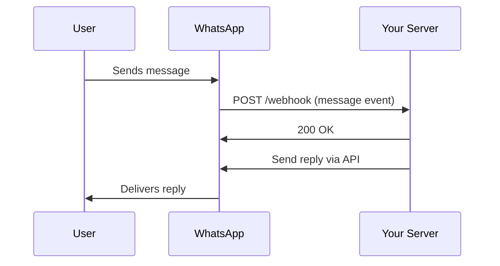

import { Aside } from '@astrojs/starlight/components';

Webhooks are the primary way to receive real-time updates from the WhatsApp Business Platform. When users send messages, when message delivery status changes, or when account settings are updated, WhatsApp sends webhook notifications to your server.

## What are Webhooks?

Webhooks are HTTP callbacks that WhatsApp sends to your server when events occur. Instead of constantly polling the API to check for new messages, webhooks push data to your application in real-time.



## Why Use Webhooks?

- **Real-time**: Receive notifications instantly when events occur
- **Efficient**: No need to poll the API constantly
- **Complete**: Get all message types, status updates, and account notifications
- **Scalable**: Handle high volumes of messages efficiently

## Webhook Event Types

The SDK supports all WhatsApp webhook event types through the `WebhookProcessor`:

### Message Events

Received when users send messages to your WhatsApp Business number:

- **Text messages** - Plain text messages
- **Media messages** - Images, videos, audio, documents, stickers
- **Interactive messages** - Button and list responses, Flow responses
- **Location messages** - Shared locations
- **Contact messages** - Shared contact cards
- **Reaction messages** - Message reactions (emoji)
- **Order messages** - Product orders from catalog

### Status Events

Received when message delivery status changes:

- `sent` - Message sent to WhatsApp servers
- `delivered` - Message delivered to recipient device
- `read` - Message read by recipient
- `failed` - Message delivery failed

### Account Events

Received when your WhatsApp Business Account settings change:

- **account_update** - Account information changes
- **account_review_update** - Account review status changes
- **account_alerts** - Important account notifications
- **business_capability_update** - Business capabilities changes

### Phone Number Events

Received when phone number settings change:

- **phone_number_name_update** - Display name changes
- **phone_number_quality_update** - Quality rating changes

### Template Events

Received when message templates change:

- **message_template_status_update** - Template approval status
- **template_category_update** - Template category changes
- **message_template_quality_update** - Template quality rating

### Other Events

- **flows** - WhatsApp Flows webhook events
- **security** - Security-related notifications
- **history** - Message history sync events

## Webhook Payload Structure

All webhooks follow this structure:

```typescript
interface WebhookPayload {
    object: 'whatsapp_business_account';
    entry: Array<{
        id: string; // Business Account ID
        changes: Array<{
            value: {
                messaging_product: 'whatsapp';
                metadata: {
                    display_phone_number: string;
                    phone_number_id: string;
                };
                // Event-specific data
                contacts?: Array<...>;
                messages?: Array<...>;
                statuses?: Array<...>;
            };
            field: 'messages' | 'account_update' | ...;
        }>;
    }>;
}
```

## Webhook Security

<Aside type="caution">
Always verify webhook signatures in production to ensure requests are coming from WhatsApp.
</Aside>

WhatsApp secures webhooks in two ways:

### 1. Verification Token

When you first configure your webhook URL in the Meta Developer Portal, WhatsApp sends a GET request with a verification token. Your server must respond with the challenge value if the token matches.

```typescript
// The SDK handles this automatically
GET /webhook?hub.mode=subscribe&hub.verify_token=YOUR_TOKEN&hub.challenge=CHALLENGE

// Respond with: CHALLENGE (if token matches)
```

### 2. Signature Verification

Each webhook POST request includes an `X-Hub-Signature-256` header with a SHA256 HMAC signature. The SDK can verify this signature to ensure the request is authentic.

## Setting Up Webhooks

To receive webhooks, you need to:

1. **Create a webhook endpoint** - An HTTPS URL that can receive POST requests
2. **Configure in Meta Developer Portal**:
   - Go to your WhatsApp Business App
   - Navigate to WhatsApp > Configuration
   - Set your Callback URL and Verify Token
   - Subscribe to webhook fields (messages, message_status, etc.)
3. **Implement webhook processing** - Use the SDK to handle incoming webhooks

## Webhook Processing Flow

```typescript
import { WebhookProcessor } from 'meta-cloud-api';

// 1. Create processor
const processor = new WebhookProcessor({
    accessToken: process.env.WHATSAPP_ACCESS_TOKEN,
    phoneNumberId: process.env.WHATSAPP_PHONE_NUMBER_ID,
    businessAcctId: process.env.WHATSAPP_BUSINESS_ACCOUNT_ID,
    webhookVerificationToken: process.env.WEBHOOK_VERIFICATION_TOKEN,
});

// 2. Register handlers
processor.onText(async (whatsapp, message) => {
    console.log('Received text:', message.text.body);
    await whatsapp.messages.text({
        to: message.from,
        body: 'Echo: ' + message.text.body,
    });
});

// 3. Process webhooks
app.post('/webhook', async (req, res) => {
    const result = await processor.processWebhook(
        new Request(req.url, {
            method: 'POST',
            headers: req.headers,
            body: JSON.stringify(req.body),
        })
    );
    res.status(result.status).send(result.body);
});
```

## Best Practices

### Response Time

<Aside type="tip">
Respond to webhook requests within 20 seconds to avoid timeouts.
</Aside>

WhatsApp expects a 200 OK response quickly. For long-running operations:

```typescript
processor.onText(async (whatsapp, message) => {
    // Acknowledge immediately
    setImmediate(async () => {
        // Process in background
        await processMessage(message);
    });
});
```

### Idempotency

WhatsApp may send the same webhook multiple times. Use message IDs to detect duplicates:

```typescript
const processedMessages = new Set();

processor.onText(async (whatsapp, message) => {
    if (processedMessages.has(message.id)) {
        return; // Already processed
    }

    processedMessages.add(message.id);
    // Process message...
});
```

### Error Handling

Handle errors gracefully to avoid webhook delivery failures:

```typescript
processor.onText(async (whatsapp, message) => {
    try {
        await processMessage(message);
    } catch (error) {
        console.error('Error processing message:', error);
        // Don't throw - still return 200 OK
    }
});
```

### Rate Limiting

Be mindful of API rate limits when responding to webhooks:

```typescript
import pLimit from 'p-limit';

const limit = pLimit(10); // Max 10 concurrent requests

processor.onText(async (whatsapp, message) => {
    await limit(() => whatsapp.messages.text({
        to: message.from,
        body: 'Response',
    }));
});
```

## Testing Webhooks Locally

During development, use ngrok or similar tools to expose your local server:

```bash
# Start your local server
npm run dev  # Running on localhost:3000

# In another terminal, start ngrok
ngrok http 3000

# Use the ngrok URL in Meta Developer Portal
# https://abc123.ngrok.io/webhook
```

<Aside>
See the [Webhook Verification](/webhooks/verification) guide for detailed setup instructions.
</Aside>

## Next Steps

- [Webhook Verification](/webhooks/verification) - Set up webhook verification
- [Express.js Integration](/webhooks/express) - Use webhooks with Express
- [Next.js Integration](/webhooks/nextjs) - Use webhooks with Next.js
- [Custom Implementation](/webhooks/custom) - Build custom webhook handlers

## Related Resources

- [Meta Webhooks Documentation](https://developers.facebook.com/docs/graph-api/webhooks/getting-started)
- [WhatsApp Webhook Fields](https://developers.facebook.com/docs/graph-api/webhooks/reference/whatsapp-business-account)
- [Message Types Reference](/types/message-types)
