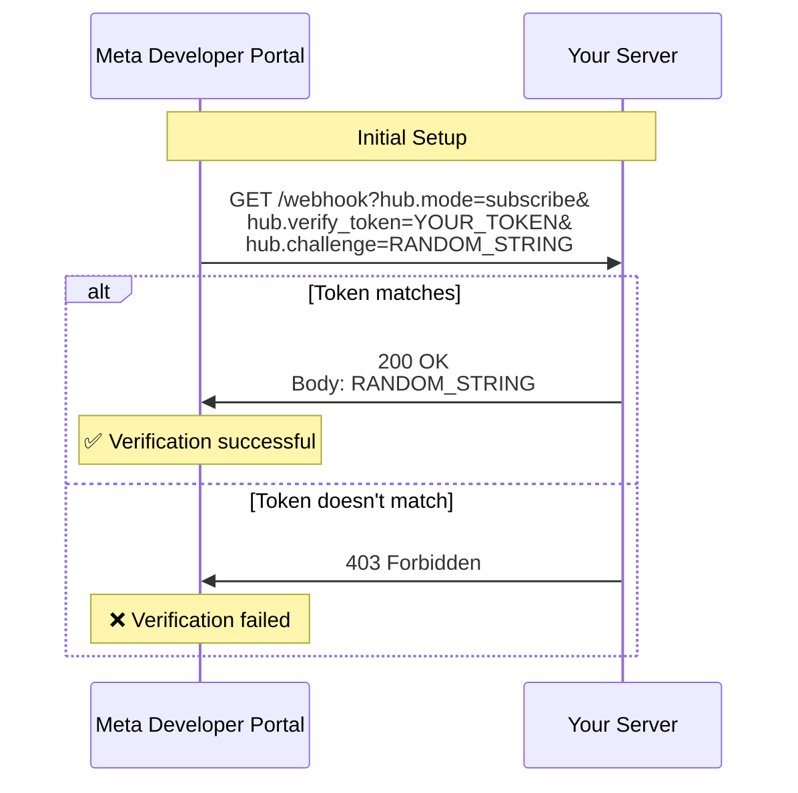

import { Aside, Code, Tabs, TabItem } from '@astrojs/starlight/components';

When you set up a webhook endpoint in the Meta Developer Portal, WhatsApp needs to verify that you own and control the endpoint. This guide explains how webhook verification works and how to implement it.

## Verification Flow



## How It Works

When you configure your webhook in the Meta Developer Portal:

1. You provide:
   - **Callback URL**: Your webhook endpoint (e.g., `https://example.com/webhook`)
   - **Verify Token**: A secret string you choose (e.g., `my-secret-token-123`)

2. WhatsApp sends a GET request to your endpoint:
   ```
   GET /webhook?hub.mode=subscribe&hub.verify_token=my-secret-token-123&hub.challenge=1234567890
   ```

3. Your server must:
   - Check that `hub.mode` equals `subscribe`
   - Check that `hub.verify_token` matches your secret token
   - Return the `hub.challenge` value as plain text with a 200 status

4. If verification succeeds, WhatsApp saves your webhook configuration

<Aside type="caution">
Never hardcode your verification token. Always use environment variables.
</Aside>

## Implementation

The `WebhookProcessor` handles verification automatically. All framework adapters (Express, Next.js) include verification support.

### Using Framework Adapters

<Tabs>
<TabItem label="Express">

```typescript
import express from 'express';
import { webhookHandler } from 'meta-cloud-api/webhook/express';

const app = express();

const whatsapp = webhookHandler({
    accessToken: process.env.WHATSAPP_ACCESS_TOKEN!,
    phoneNumberId: parseInt(process.env.WHATSAPP_PHONE_NUMBER_ID!),
    businessAcctId: process.env.WHATSAPP_BUSINESS_ACCOUNT_ID,
    webhookVerificationToken: process.env.WEBHOOK_VERIFICATION_TOKEN!,
});

// GET request automatically handled
app.get('/webhook', whatsapp.GET);

// POST requests for actual webhooks
app.post('/webhook', express.json(), whatsapp.POST);

app.listen(3000);
```

</TabItem>
<TabItem label="Next.js App Router">

```typescript
// app/api/webhook/route.ts
import { webhookHandler } from 'meta-cloud-api/webhook/nextjs-app';

const whatsapp = webhookHandler({
    accessToken: process.env.WHATSAPP_ACCESS_TOKEN!,
    phoneNumberId: parseInt(process.env.WHATSAPP_PHONE_NUMBER_ID!),
    businessAcctId: process.env.WHATSAPP_BUSINESS_ACCOUNT_ID,
    webhookVerificationToken: process.env.WEBHOOK_VERIFICATION_TOKEN!,
});

// Export GET and POST handlers
export const { GET, POST } = whatsapp.webhook;
```

</TabItem>
<TabItem label="Next.js Pages Router">

```typescript
// pages/api/webhook.ts
import { nextjsWebhookHandler } from 'meta-cloud-api';

export const config = {
    api: {
        bodyParser: false, // Important for webhook processing
    },
};

const whatsapp = nextjsWebhookHandler({
    accessToken: process.env.WHATSAPP_ACCESS_TOKEN!,
    phoneNumberId: parseInt(process.env.WHATSAPP_PHONE_NUMBER_ID!),
    businessAcctId: process.env.WHATSAPP_BUSINESS_ACCOUNT_ID,
    webhookVerificationToken: process.env.WEBHOOK_VERIFICATION_TOKEN!,
});

// Handles both GET (verification) and POST (webhooks)
export default whatsapp.webhook;
```

</TabItem>
</Tabs>

### Manual Implementation

If you're building a custom adapter, use `WebhookProcessor` directly:

```typescript
import { WebhookProcessor } from 'meta-cloud-api';

const processor = new WebhookProcessor({
    accessToken: process.env.WHATSAPP_ACCESS_TOKEN!,
    phoneNumberId: parseInt(process.env.WHATSAPP_PHONE_NUMBER_ID!),
    businessAcctId: process.env.WHATSAPP_BUSINESS_ACCOUNT_ID,
    webhookVerificationToken: process.env.WEBHOOK_VERIFICATION_TOKEN!,
});

// Handle GET request
app.get('/webhook', async (req, res) => {
    const mode = req.query['hub.mode'];
    const token = req.query['hub.verify_token'];
    const challenge = req.query['hub.challenge'];

    const result = await processor.processVerification(
        mode as string,
        token as string,
        challenge as string
    );

    res.status(result.status)
       .set(result.headers)
       .send(result.body);
});
```

## Setting Up in Meta Developer Portal

### Step 1: Configure Webhook

1. Go to [Meta Developer Portal](https://developers.facebook.com/apps)
2. Select your WhatsApp Business App
3. Navigate to **WhatsApp > Configuration**
4. In the **Webhook** section, click **Edit**
5. Enter your **Callback URL** (must be HTTPS):
   ```
   https://your-domain.com/webhook
   ```
6. Enter your **Verify Token** (must match your environment variable):
   ```
   my-secret-token-123
   ```
7. Click **Verify and Save**

### Step 2: Subscribe to Webhook Fields

After verification succeeds, subscribe to the webhook fields you need:

- ✅ **messages** - Incoming messages from users
- ✅ **message_status** - Message delivery status updates
- ⚪ **account_alerts** - Account notifications
- ⚪ **account_update** - Account changes
- ⚪ **account_review_update** - Review status changes
- ⚪ **business_capability_update** - Capability changes
- ⚪ **flows** - WhatsApp Flows events
- ⚪ **message_template_status_update** - Template status
- ⚪ **phone_number_name_update** - Phone number name changes
- ⚪ **phone_number_quality_update** - Quality rating changes

<Aside type="tip">
At minimum, subscribe to **messages** to receive incoming messages. Add others as needed for your application.
</Aside>

## Testing Verification

### Local Testing with ngrok

During development, use ngrok to expose your local server:

```bash
# Terminal 1: Start your server
npm run dev
# Server running on http://localhost:3000

# Terminal 2: Start ngrok
ngrok http 3000
# Forwarding https://abc123.ngrok.io -> http://localhost:3000
```

Use the ngrok HTTPS URL in the Meta Developer Portal:
```
https://abc123.ngrok.io/webhook
```

### Manual Verification Test

Test your verification endpoint manually:

```bash
curl "https://your-domain.com/webhook?hub.mode=subscribe&hub.verify_token=my-secret-token-123&hub.challenge=test123"
# Should return: test123
```

### Common Issues

#### 403 Forbidden

**Problem**: Verification token doesn't match

**Solution**:
```typescript
// Make sure this matches what you entered in Meta Developer Portal
webhookVerificationToken: process.env.WEBHOOK_VERIFICATION_TOKEN!,
```

Check your `.env` file:
```bash
WEBHOOK_VERIFICATION_TOKEN=my-secret-token-123
```

#### Connection Timeout

**Problem**: Server not responding or URL not accessible

**Solutions**:
- Ensure your server is running
- Check firewall rules allow incoming HTTPS traffic
- Verify SSL certificate is valid (use Let's Encrypt)
- For ngrok, make sure tunnel is active

#### URL Not Found (404)

**Problem**: Webhook route not configured

**Solution**: Ensure you've set up the GET handler at the correct path:

```typescript
// Express
app.get('/webhook', whatsapp.GET);

// Next.js App Router: app/api/webhook/route.ts
export const { GET, POST } = whatsapp.webhook;

// Next.js Pages Router: pages/api/webhook.ts
export default whatsapp.webhook;
```

## Security Considerations

### Use Strong Verification Tokens

Generate a random, secure token:

```bash
# Generate a secure random token
node -e "console.log(require('crypto').randomBytes(32).toString('hex'))"
```

Store it in your `.env` file:
```bash
WEBHOOK_VERIFICATION_TOKEN=a1b2c3d4e5f6...
```

<Aside type="caution">
Never commit your `.env` file to version control. Add it to `.gitignore`.
</Aside>

### HTTPS Only

WhatsApp requires HTTPS for production webhooks. In development:

- Use ngrok for local testing
- Use proper SSL certificates in production (Let's Encrypt, Cloudflare, etc.)

### Signature Verification

While the verify token authenticates the initial setup, you should also verify the signature of incoming webhook POST requests:

```typescript
// Coming in future SDK versions
processor.enableSignatureVerification(process.env.APP_SECRET);
```

## Environment Variables

Required environment variables for webhook verification:

```bash
# .env
WHATSAPP_ACCESS_TOKEN=your_access_token
WHATSAPP_PHONE_NUMBER_ID=123456789
WHATSAPP_BUSINESS_ACCOUNT_ID=987654321
WEBHOOK_VERIFICATION_TOKEN=your_secure_random_token
```

## Next Steps

Now that your webhook is verified:

- [Express Integration](/webhooks/express) - Build with Express.js
- [Next.js Integration](/webhooks/nextjs) - Build with Next.js
- [Custom Implementation](/webhooks/custom) - Build custom handlers

## Troubleshooting

### Verification Keeps Failing

1. Check server logs for incoming requests
2. Verify token matches exactly (case-sensitive)
3. Ensure GET handler is responding with plain text, not JSON
4. Test with curl to isolate issues
5. Check ngrok web interface (http://localhost:4040) to see requests

### Need Help?

- [Meta Webhooks Documentation](https://developers.facebook.com/docs/graph-api/webhooks/getting-started)
- [WhatsApp Business Platform Webhooks](https://developers.facebook.com/docs/whatsapp/webhooks)
- [GitHub Issues](https://github.com/froggy1014/meta-cloud-api/issues)
